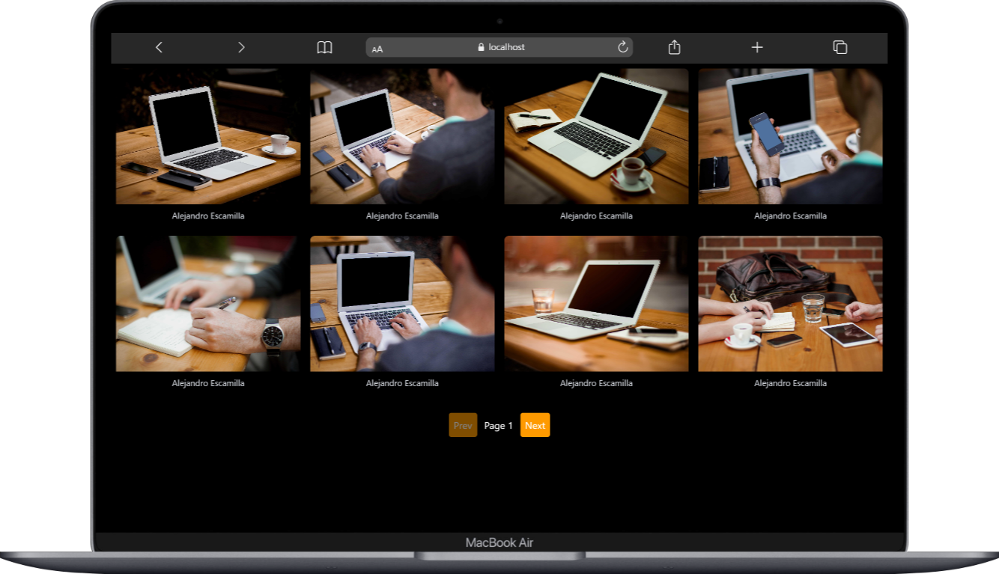
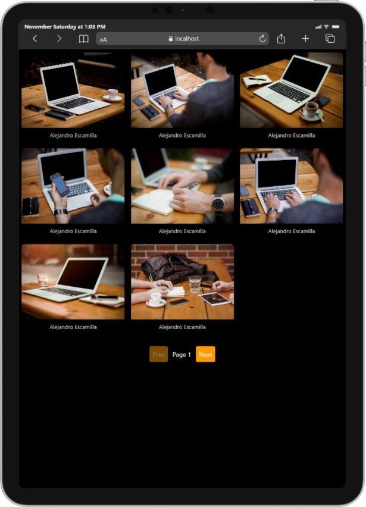
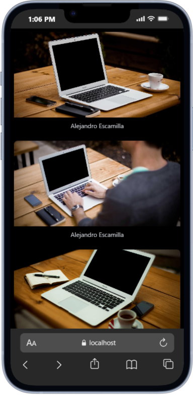

# Image Gallery — Responsive Gallery with React & Vite

A responsive image gallery built with React and Vite. This small project fetches example images from the Picsum API and displays them in a responsive grid. The gallery adapts for mobile, tablet and desktop.

## Demo & Purpose

This project is meant as a lightweight gallery that demonstrates:

- Responsive grid layout using utility classes (Tailwind CSS or custom CSS)
- Fetching images from an API (Picsum)
- Basic pagination controls
- Clean dark-themed UI with accessible links

## Screenshots

Desktop View



Tablet View



Mobile View




## Features

- Responsive grid that changes columns by screen size
- Images keep aspect ratio using `object-cover`
- Accessible links open in new tabs (`rel="noopener noreferrer"`)
- Pagination with Prev / Next buttons

## Tech Stack

- React
- Vite
- Axios (for API requests)
- Tailwind CSS (optional — project uses utility classes; if Tailwind isn't configured, the classes will be ignored)

## How to run locally

1. Install dependencies

```powershell
npm install
```

2. Start the dev server

```powershell
npm run dev
```

3. Open the URL printed by Vite (for example `http://localhost:5173`).

## Files to check

- `src/App.jsx` — main gallery component and layout
- `src/index.css` — global styles (if present)
- `src/assets/` — images used in this README and screenshots

## Notes on the images used

I detected the following images in `src/assets`:

- `Ipad.png`
- `Laptop.png`
- `IPhone/` (a folder) — inside `IPhone/` you should confirm the exact image filename to use in the README. I referenced `IPhone/iPhone-Preview.png` as an example; if your file has a different name, update the README to match.

## Contributing

Contributions are welcome. Open an issue or send a pull request with improvements.


